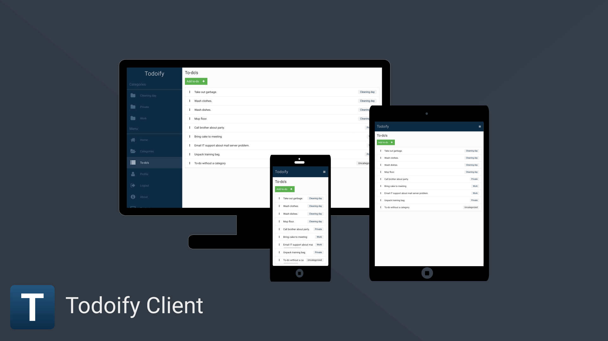

#  Todoify Client

## Intro

This is Todoify Client, a front-end built with VueJS that requires a API connection to our [Todoify Server](https://github.com/luxwarp/todoify-server).

Todoify is a simple but great to-do web app that let's you organize your tasks with categories.
It also has full offline support so you can use it without creating an account, or create and account and then work offline when you don't have any internet connection. Once you have a connection again Todoify will automatically sync to our server.

Full responsive design and Progressive Web App support so you can use it on any device with a browser and also install it to your homescreen or browser app like chrome web app on your computer.

<a href="graphics/promotion/todoify-client-big-image-1920x1080.png"></a>

Do you want try out Todoify Client live you can visit [todoify.luxwarp.info](https://todoify.luxwarp.info).

Check [wiki](https://github.com/luxwarp/todoify-client/wiki) for change log and more information.

## Start coding on Todoify Client

Do you want to use this project as a base for your own customizes or contribute?
Feel free to fork it and send pull request and we will look it over.

### Download Todoify Client for development.

```
git clone https://github.com/luxwarp/todoify-client.git
```

Install dependencies

```
npm install
```

Edit .env file to match your settings. By default it's setup to work with our public [Todoify Server](https://github.com/luxwarp/todoify-server)

Start development server

```
npm run serve
```

Compiles and minifies for production to folder dist.

```
npm run build
```

To build in modern mode

```
npm run build:modern
```

Read more about [modern mode.](https://cli.vuejs.org/guide/browser-compatibility.html#modern-mode)

Run VueJS lint.

```
npm run lint
```

VueJS customize configuration

See [Configuration Reference](https://cli.vuejs.org/config/).

## License

ISC © 2019 Copyright [Mikael Luxwarp Carlsson](https://luxwarp.info)

## Note

Feel free to contribute the way you want.
